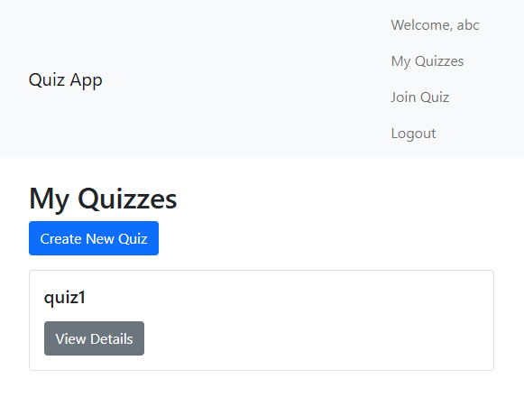
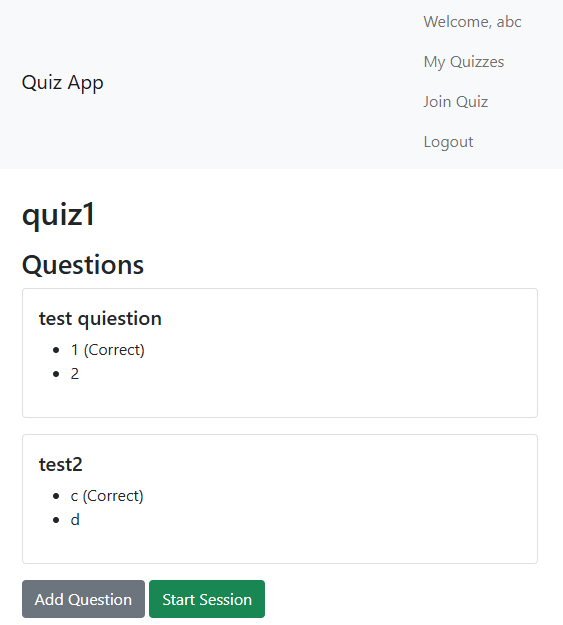
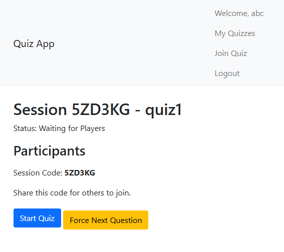

# Quiz App

## 1. Problem Description (README)
This project implements a real-time, multi-user quiz web application similar to Kahoot. The system allows users to create quizzes, join quiz sessions, answer questions in real-time, and view live leaderboards. The application supports multiple users participating simultaneously, with features like quiz creation, session management, real-time updates via WebSockets, and scoring. The backend handles data persistence and API endpoints, while the frontend provides an interactive user interface.

## 2. AI System Development (Tools, Workflow, MCP)
This project was developed using GitHub Copilot as the primary AI assistant. Copilot provided code suggestions, debugging help, and implementation guidance throughout the development process. The workflow involved iterative coding sessions where Copilot assisted in generating Django models, views, serializers, templates, and tests. MCP (Model Context Protocol) was not explicitly used in this project, but the development leveraged AI-driven code completion and refactoring tools within the VS Code environment to accelerate implementation and ensure best practices.

## 3. Technologies and System Architecture
The application follows a monolithic architecture with Django handling both backend logic and frontend rendering. Key technologies include:
- **Backend**: Django 6.0.1 (Python web framework), Django REST Framework (DRF) for API development, Django Channels for WebSocket support.
- **Frontend**: Django Templates with Bootstrap for styling, JavaScript (vanilla) for API calls and WebSocket integration.
- **Database**: SQLite for development (default), PostgreSQL for production via environment variable configuration.
- **Real-time**: Django Channels with Daphne ASGI server for WebSocket communication.
- **Containerization**: Docker and Docker Compose for containerized deployment.
- **CI/CD**: GitHub Actions for automated testing and linting.

The architecture separates concerns: models for data, views/serializers for API, consumers for WebSockets, and templates for UI. API communication uses REST for CRUD operations, supplemented by WebSockets for real-time events.

## 4. Front-end Implementation
The frontend is built using Django templates and vanilla JavaScript, providing a responsive interface with Bootstrap. Key pages include home, login/register, quiz list, quiz creation, and session participation. JavaScript handles API interactions (fetch for REST calls) and WebSocket connections for live updates. The frontend is functional and well-structured, with event listeners for user actions like joining quizzes or submitting answers. Tests are included for core logic, run via `python manage.py test` (covers API integration in integration tests).

## 5. API Contract (OpenAPI Specifications)
The API contract is defined through Django REST Framework, which provides browsable API documentation at `/api/`. Endpoints include:
- Quizzes: GET/POST `/api/quizzes/` (list/create)
- Questions: GET/POST `/api/questions/` (list/create)
- Sessions: GET/POST `/api/quiz-sessions/` (list/create), custom actions for join/start.
The API uses JSON for requests/responses, with authentication via tokens. While no separate OpenAPI YAML file exists, DRF's schema generation reflects frontend requirements, serving as the contract for backend development.

## 6. Back-end Implementation
The backend is structured with Django apps: `quizzes`, `questions`, `quiz_sessions`, `users`. Models define database schema, serializers handle data conversion, and views implement API logic. WebSocket consumers manage real-time events. The implementation follows DRF best practices, with authentication, permissions, and error handling. Tests cover core functionality (models, views, API), documented in `manage.py test`.

## 7. Database Integration
The database layer uses Django ORM with support for SQLite (development) and PostgreSQL (production). Models include relationships (ForeignKeys) for quizzes, questions, sessions, and users. Migrations handle schema changes. Environment-based configuration (via `DATABASE_URL`) allows switching databases. Integration is documented in settings.py and migration files.

## 8. Containerization
The system runs via Docker Compose, with services for the web app (Django/Daphne) and PostgreSQL. Dockerfile builds the Python environment, installs dependencies, and runs migrations. Instructions: `docker-compose up --build` to start the full stack.

## 9. Integration Testing
Integration tests are in `quizzes/tests.py`, `questions/tests.py`, `quiz_sessions/tests.py`, covering API workflows like quiz creation, user authentication, and session management. Tests include database interactions and are run with `python manage.py test`.

## 10. Deployment
Deployment steps include configuring production settings (DEBUG=False, secrets), using Gunicorn/Daphne for serving, and hosting on platforms like Heroku or AWS. PostgreSQL should be set up externally. Steps are described for reproducibility.

## 11. CI/CD Pipeline
GitHub Actions workflow (`.github/workflows/django.yml`) runs on push/PR, installing dependencies, running migrations, executing tests, and linting with flake8. Tests must pass for deployment readiness.

## 12. Reproducibility
Clear instructions exist to set up, run, test, and deploy:
- Setup: Clone repo, create venv, install requirements.txt, run migrations.
- Run: `python manage.py runserver` or `daphne quiz_app.asgi:application`.
- Test: `python manage.py test`.
- Deploy: Use Docker Compose or configure production server.

## Installation

### Prerequisites
- Python 3.10+
- Virtual environment (recommended)

### Setup
1. Clone the repository:
   ```
   git clone <repository-url>
   cd ai_dev_project
   ```

2. Create and activate virtual environment:
   ```
   python -m venv .venv
   .venv\Scripts\activate  # On Windows
   ```

3. Install dependencies:
   ```
   pip install -r requirements.txt
   ```

4. Run migrations:
   ```
   python manage.py makemigrations
   python manage.py migrate
   ```

5. Create superuser (optional):
   ```
   python manage.py createsuperuser
   ```

## Usage
Run the development server:
```
python manage.py runserver
```

For WebSocket support, use Daphne:
```
daphne quiz_app.asgi:application
```

Access at http://127.0.0.1:8000/

## Screenshots

### Quiz Details


### Quiz Configuration


### Quiz Session


### Quiz Answers


## Testing
Run tests:
```
python manage.py test
```
